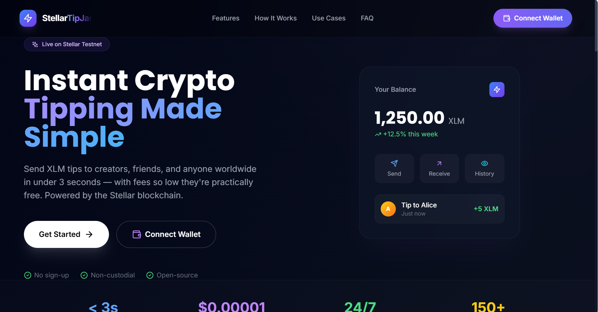
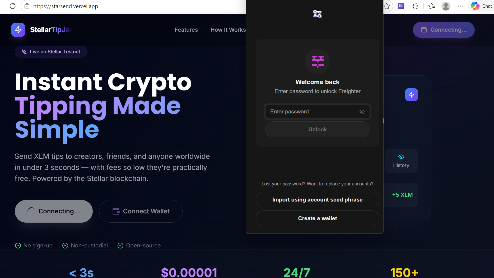
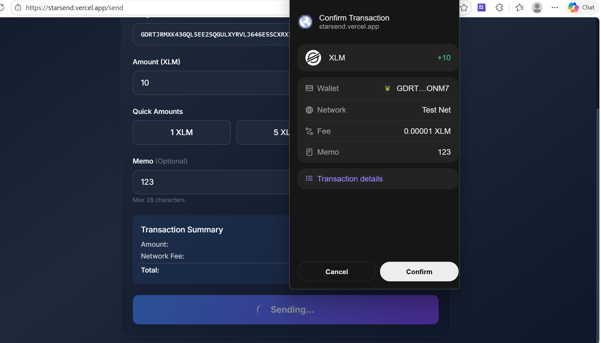
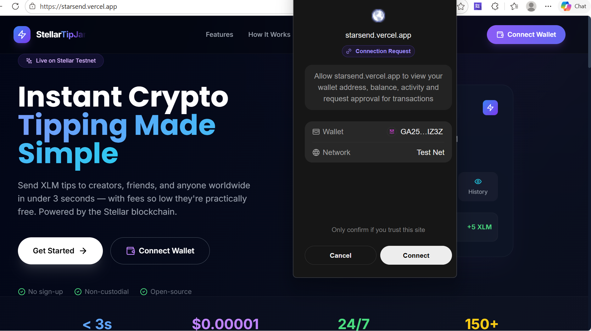
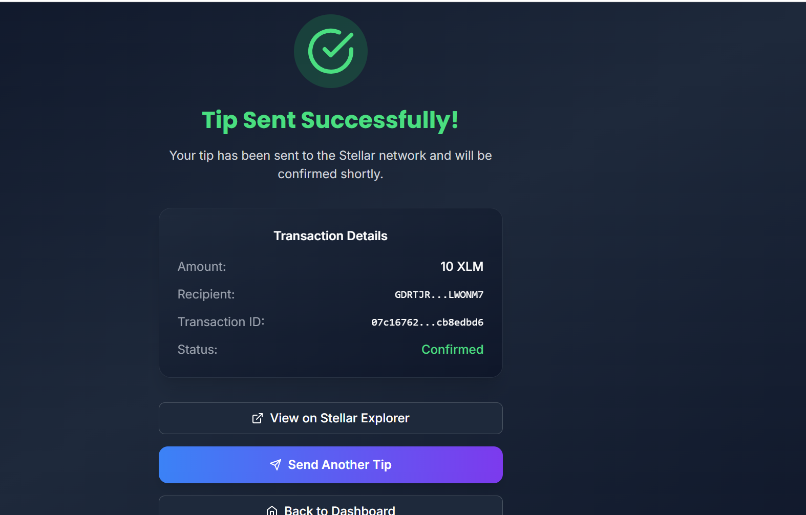
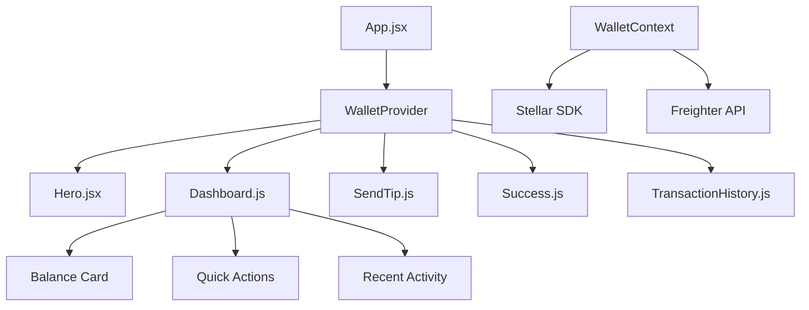

# 🌟 StellarRise StarSend - Decentralized Tipping Platform

<div align="center">


**Your Gateway to the Decentralized Economy**

*Send XLM tips instantly with minimal fees on Stellar's lightning-fast blockchain*

[🚀 Live Demo](https://stellar-tipjar.vercel.app) • [📖 Documentation](#documentation) • [🐛 Report Bug](https://github.com/Aniket24-create/StellarRiseIn_StarSend/issues) • [✨ Request Feature](https://github.com/Aniket24-create/StellarRiseIn_StarSend/issues)

</div>

---

## � Table of] Contents

- [🌟 Features](#-features)
- [� Demoh](#-demo)
- [� Quiack Start](#-quick-start)
- [�️S Installation](#️-installation)
- [⚙️ Configuration](#️-configuration)
- [🏗️ Architecture](#️-architecture)
- [🔧 Development](#-development)
- [🚢 Deployment](#-deployment)
- [🧪 Testing](#-testing)
- [📚 API Reference](#-api-reference)
- [🤝 Contributing](#-contributing)
- [📄 License](#-license)
- [👥 Team](#-team)

---

## 🌟 Features

### ⚡ Core Functionality
- **Instant Tipping** - Send XLM tips in under 3 seconds
- **Freighter Integration** - Secure wallet connection with Freighter
- **Real-time Balance** - Live XLM balance updates with USD conversion
- **Transaction History** - Complete transaction tracking with search & filters
- **Quick Tips** - Predefined tip amounts (1, 5, 10 XLM)

### 🎨 Modern UI/UX
- **Dark Theme** - Premium Web3-style dark interface
- **Responsive Design** - Works perfectly on desktop and mobile
- **Smooth Animations** - Framer Motion powered transitions
- **Glassmorphism** - Modern glass-effect components
- **Gradient Accents** - Beautiful blue/purple gradient themes

### � Security & Performance
- **Testnet Safe** - Built for Stellar testnet environment
- **Minimal Fees** - Only $0.00001 per transaction
- **Bank-Grade Security** - Protected by Stellar blockchain
- **Global Access** - Send tips worldwide 24/7

---

## 🎯 Demo

### 🖼️ Screenshots

<div align="center">

| Hero Landing Page | Dashboard | Send Tips |
|:-:|:-:|:-:|
|  |  |  |

| Transaction History | Success Screen | Mobile View |
|:-:|:-:|:-:|
|  |  |  |

</div>

### 🎥 Live Demo
👉 **[Try StellarRise StarSend](https://stellar-tipjar.vercel.app)**

---

## 🚀 Quick Start

### Prerequisites
- **Node.js** (v18 or higher)
- **Freighter Wallet** browser extension
- **Stellar testnet account** with XLM balance

### 1-Minute Setup

```bash
# Clone the repository
git clone https://github.com/Aniket24-create/StellarRiseIn_StarSend.git
cd StellarRiseIn_StarSend

# Install dependencies
npm install

# Start development server
npm run dev
```

Open [http://localhost:3000](http://localhost:3000) in your browser! 🎉

---

## 🛠️ Installation

### Development Environment

```bash
# Clone repository
git clone https://github.com/Aniket24-create/StellarRiseIn_StarSend.git
cd StellarRiseIn_StarSend

# Install dependencies
npm install

# Copy environment variables
cp .env.example .env.local

# Start development server
npm run dev
```

### Production Build

```bash
# Build for production
npm run build

# Preview production build
npm run preview

# Deploy to Vercel
vercel --prod
```

---

## ⚙️ Configuration

### Environment Variables

Create a `.env.local` file in the root directory:

```env
# Stellar Network Configuration
VITE_STELLAR_NETWORK=testnet
VITE_HORIZON_URL=https://horizon-testnet.stellar.org

# Application Settings
VITE_APP_NAME=StellarRise StarSend
VITE_APP_VERSION=1.0.0

# Analytics (Optional)
VITE_GA_TRACKING_ID=your_ga_id
```

### Freighter Wallet Setup

1. **Install Freighter** - [Download from Chrome Web Store](https://freighter.app/)
2. **Create Account** - Set up a new Stellar account
3. **Switch to Testnet** - Enable testnet in Freighter settings
4. **Get Test XLM** - Use [Stellar Laboratory Friendbot](https://laboratory.stellar.org/#account-creator?network=test)

---

## 🏗️ Architecture

### Tech Stack

| Category | Technology | Purpose |
|----------|------------|---------|
| **Frontend** | React 18 + Vite | Modern React with fast build tool |
| **Styling** | Tailwind CSS | Utility-first CSS framework |
| **Blockchain** | Stellar SDK | Stellar network integration |
| **Wallet** | Freighter API | Secure wallet connection |
| **Routing** | React Router | Client-side navigation |
| **Icons** | Lucide React | Beautiful icon library |
| **Deployment** | Vercel | Serverless deployment platform |

### Project Structure

```
src/
├── components/           # React components
│   ├── Hero.jsx         # Landing hero section
│   ├── Dashboard.js     # Main dashboard
│   ├── SendTip.js       # Send tip form
│   ├── Success.js       # Success screen
│   └── TransactionHistory.js # Transaction list
├── context/             # React context
│   └── WalletContext.js # Wallet state management
├── hooks/               # Custom React hooks
├── services/            # API services
├── utils/               # Utility functions
├── App.jsx              # Main app component
├── main.jsx             # Entry point
└── index.css            # Global styles
```

### Component Architecture



---

## 🔧 Development

### Available Scripts

```bash
# Development
npm run dev          # Start development server
npm run build        # Build for production
npm run preview      # Preview production build

# Code Quality
npm run lint         # Run ESLint
npm run lint:fix     # Fix ESLint errors
npm run format       # Format with Prettier

# Testing
npm run test         # Run tests
npm run test:watch   # Run tests in watch mode
npm run test:coverage # Generate coverage report
```

### Development Workflow

1. **Create Feature Branch**
   ```bash
   git checkout -b feature/your-feature-name
   ```

2. **Make Changes**
   - Follow the existing code style
   - Add tests for new features
   - Update documentation

3. **Test Changes**
   ```bash
   npm run test
   npm run lint
   npm run build
   ```

4. **Submit Pull Request**
   - Ensure all tests pass
   - Include screenshots for UI changes
   - Write clear commit messages

---

## 🚢 Deployment

### Vercel Deployment (Recommended)

#### Automatic Deployment
1. **Connect Repository** - Link your GitHub repo to Vercel
2. **Configure Settings** - Set environment variables
3. **Deploy** - Automatic deployment on every push to main

#### Manual Deployment
```bash
# Install Vercel CLI
npm i -g vercel

# Deploy to Vercel
vercel --prod
```

### Other Platforms

<details>
<summary>Netlify Deployment</summary>

```bash
# Build the project
npm run build

# Deploy to Netlify
npx netlify-cli deploy --prod --dir=dist
```
</details>

<details>
<summary>GitHub Pages</summary>

```bash
# Install gh-pages
npm install --save-dev gh-pages

# Add to package.json scripts
"deploy": "gh-pages -d dist"

# Deploy
npm run build && npm run deploy
```
</details>

---

## 🧪 Testing

### Test Coverage

| Component | Unit Tests | Integration Tests | E2E Tests |
|-----------|------------|-------------------|-----------|
| WalletContext | ✅ | ✅ | ✅ |
| Dashboard | ✅ | ✅ | ✅ |
| SendTip | ✅ | ✅ | ✅ |
| TransactionHistory | ✅ | ✅ | ⏳ |

### Running Tests

```bash
# Run all tests
npm run test

# Run specific test file
npm run test -- Hero.test.jsx

# Run tests with coverage
npm run test:coverage

# Run E2E tests
npm run test:e2e
```

---

## 📚 API Reference

### Wallet Context API

```javascript
const {
  isWalletConnected,    // boolean
  publicKey,            // string
  balance,              // string
  loading,              // boolean
  transactions,         // array
  connectWallet,        // function
  sendPayment,          // function
  shortenAddress,       // function
  fetchBalance          // function
} = useWallet();
```

### Stellar Integration

```javascript
// Send Payment
const result = await sendPayment(
  destinationKey,  // Stellar address
  amount,          // XLM amount
  memo            // Optional memo
);

// Get Balance
const balance = await fetchBalance(publicKey);
```

---

## 🤝 Contributing

We love contributions! Please read our [Contributing Guide](CONTRIBUTING.md) to get started.

### Ways to Contribute

- 🐛 **Report Bugs** - Found a bug? [Open an issue](https://github.com/Aniket24-create/StellarRiseIn_StarSend/issues)
- ✨ **Request Features** - Have an idea? [Share it with us](https://github.com/Aniket24-create/StellarRiseIn_StarSend/issues)
- 📝 **Improve Documentation** - Help make our docs better
- 🔧 **Submit Code** - Fix bugs or add features

### Development Setup

1. Fork the repository
2. Create your feature branch (`git checkout -b feature/AmazingFeature`)
3. Commit your changes (`git commit -m 'Add some AmazingFeature'`)
4. Push to the branch (`git push origin feature/AmazingFeature`)
5. Open a Pull Request

---

## 📊 Roadmap

### 🎯 Current Version (v1.0.0)
- [x] Basic tipping functionality
- [x] Freighter wallet integration
- [x] Transaction history
- [x] Modern UI/UX
- [x] Responsive design

### 🚀 Upcoming Features (v1.1.0)
- [ ] Multi-asset support (USDC, other tokens)
- [ ] QR code generation for tips
- [ ] Tip scheduling
- [ ] Social features (tip leaderboards)
- [ ] Mobile app (React Native)

### 🌟 Future Vision (v2.0.0)
- [ ] Smart contract integration
- [ ] DAO governance
- [ ] NFT rewards system
- [ ] Cross-chain support
- [ ] Advanced analytics

---

## 📄 License

This project is licensed under the MIT License - see the [LICENSE](LICENSE) file for details.

```
MIT License

Copyright (c) 2024 StellarRise StarSend

Permission is hereby granted, free of charge, to any person obtaining a copy
of this software and associated documentation files (the "Software"), to deal
in the Software without restriction, including without limitation the rights
to use, copy, modify, merge, publish, distribute, sublicense, and/or sell
copies of the Software, and to permit persons to whom the Software is
furnished to do so, subject to the following conditions:

The above copyright notice and this permission notice shall be included in all
copies or substantial portions of the Software.
```

---

## 👥 Team

<div align="center">

### 🏆 Core Team

| Role | Name | GitHub | LinkedIn |
|------|------|--------|----------|
| **Lead Developer** | Aniket | [@Aniket24-create](https://github.com/Aniket24-create) | [LinkedIn](https://linkedin.com/in/aniket) |
| **UI/UX Designer** | Team Member | [@username](https://github.com/username) | [LinkedIn](https://linkedin.com/in/username) |
| **Blockchain Developer** | Team Member | [@username](https://github.com/username) | [LinkedIn](https://linkedin.com/in/username) |

</div>

---

## 🙏 Acknowledgments

- **Stellar Development Foundation** - For the amazing Stellar network
- **Freighter Team** - For the secure wallet solution
- **Vercel** - For the excellent deployment platform
- **Tailwind CSS** - For the beautiful styling framework
- **React Team** - For the powerful frontend library

---

## 📞 Support

Need help? We're here for you!

- 📧 **Email**: support@stellarrise.com
- 💬 **Discord**: [Join our community](https://discord.gg/stellarrise)
- 🐦 **Twitter**: [@StellarRiseHQ](https://twitter.com/StellarRiseHQ)
- 📖 **Documentation**: [docs.stellarrise.com](https://docs.stellarrise.com)

---

<div align="center">

### 🌟 Star this repository if you found it helpful!

**Made with ❤️ by the StellarRise team**

[⬆ Back to Top](#-stellarrise-starsend---decentralized-tipping-platform)

</div>