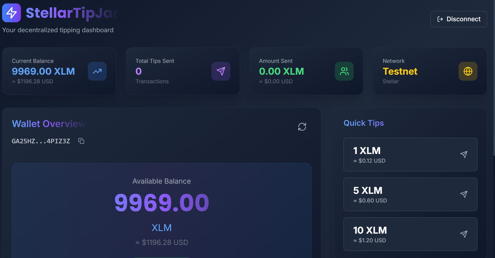

# 🪙 StarSend (StellarRiseIn)

<div align="center">
  
  
  
  
  
</div>

---

## 🌐 Live Deployment
🚀 **Experience the app live:** [https://stellar-rise-in-star-send.vercel.app/](https://stellar-rise-in-star-send.vercel.app/)

---

## 📖 Table of Contents
- [🚀 Overview](#-overview)
- [✨ Key Features](#-key-features)
- [📸 Screenshots](#-screenshots)
- [🏗️ Technical Architecture](#-technical-architecture)
- [🛠️ Available Scripts](#-available-scripts)
- [📜 Smart Contract Features](#-smart-contract-features)
- [🚀 Getting Started](#-getting-started)
- [🔒 Security & Environment](#-security--environment)
- [⚙️ CI/CD Pipeline](#-cicd-pipeline)

---

## 🚀 Overview
**StarSend** is a premium, gasless micro-tipping dApp built on the **Stellar Testnet**. It allows users to send XLM tips to any Stellar address or federation alias instantly, with a focus on a seamless user experience and modern UI.

### 🔗 Quick Links
- **Smart Contract Docs:** [Google Drive Reference](https://drive.google.com/file/d/157Dmtl1B84Ruxj4ppNiP84yQJXNSvqCY/view?usp=drive_link)
- **GitHub Repository:** [Aniket24-create/StellarRiseIn_StarSend](https://github.com/Aniket24-create/StellarRiseIn_StarSend)

---

## ✨ Key Features

- 💸 **Gasless Tipping** - Simulated gasless mode for zero-fee transactions.
- 🔑 **Freighter Wallet** - Seamless integration with the Freighter browser extension.
- 🌐 **Federation Support** - Resolve aliases like `@aniket` or `@john` to public keys.
- 📊 **Real-time Dashboard** - Live XLM balance and transaction history.
- 📷 **QR Code Scanner** - Quickly scan recipient addresses via camera.
- 🔓 **Demo Mode** - Test the app without needing a real wallet installed.
- 🎨 **Premium UI** - Glassmorphism design with neon accents and micro-animations.

---

## 📸 Screenshots

<div align="center">
  <table>
    <tr>
      <td align="center"><b>Landing Page</b></td>
      <td align="center"><b>Dashboard</b></td>
    </tr>
    <tr>
      <td></td>
      <td></td>
    </tr>
    <tr>
      <td align="center"><b>Wallet Connection</b></td>
      <td align="center"><b>Payment Confirmation</b></td>
    </tr>
    <tr>
      <td></td>
      <td></td>
    </tr>
    <tr>
      <td align="center"><b>Payment Successful</b></td>
      <td align="center"><b>Transaction History</b></td>
    </tr>
    <tr>
      <td></td>
      <td></td>
    </tr>
  </table>
</div>

---

## 🏗️ Technical Architecture

### Directory Structure
```text
src/
├── components/          # Reusable UI components (Dashboard, QR tools, etc.)
├── services/           # External service integrations (Stellar SDK, Wallet)
├── App.jsx             # Main application entry and routing
├── index.css           # Global styles and Tailwind imports
└── main.jsx            # React DOM mounting
```

### Key Technical Decisions
- **React + Vite**: Leveraged for ultra-fast Hot Module Replacement (HMR) and optimized production builds.
- **Tailwind CSS**: Used for implementing a consistent, glassmorphism-based design system with neon accents.
- **Soroban (Rust)**: Chosen for on-chain logic to ensure transparent and secure tipping interactions.
- **Freighter API**: Integrated to provide a secure, non-custodial experience for Stellar users.

---

## 🛠️ Available Scripts

| Command | Description |
| :--- | :--- |
| `npm run dev` | Starts the development server at `localhost:5173`. |
| `npm run build` | Compiles the application into the `dist/` folder for production. |
| `npm run preview` | Locally previews the production build. |
| `npm run lint` | Runs ESLint to check for code quality and style issues. |

---

## 📜 Smart Contract Features

The **TipJar** Soroban contract provides the following on-chain capabilities:

- **Initialization (`init`)**: Sets the permanent owner of the tip jar. Prevents re-initialization for security.
- **Tipping (`tip`)**: Allows users to send tips. Requires authentication via `sender.require_auth()` and emits a ledger event for transparency.
- **Querying (`get_owner`)**: Publicly exposes the owner's address for frontend verification.

---

## 🚀 Quick Deploy

### 1. Frontend (Vercel)
The fastest way to deploy the frontend is using the Vercel integration:
[](https://vercel.com/new/clone?repository-url=https://github.com/Aniket24-create/StellarRiseIn_StarSend)

### 2. Smart Contract (Stellar CLI)
```bash
cd contracts
cargo build --target wasm32-unknown-unknown --release
stellar contract deploy --wasm target/wasm32-unknown-unknown/release/starsend_contract.wasm --source <YOUR_SECRET> --network testnet
```

---

## 🚀 Getting Started

### Prerequisites
- Node.js ≥ 18
- npm ≥ 9
- [Freighter Wallet](https://freighter.app/) extension (optional if using Demo Mode)

### Installation
1. **Clone the repository:**
   ```bash
   git clone https://github.com/Aniket24-create/StellarRiseIn_StarSend.git
   cd StellarRiseIn_StarSend
   ```
2. **Install dependencies:**
   ```bash
   npm install
   ```
3. **Run locally:**
   ```bash
   npm start
   ```

---

## 🔒 Security & Environment
- **Network:** Configured for **Stellar Testnet**.
- **Non-Custodial:** StarSend never stores or accesses your private keys.

## ⚙️ CI/CD Pipeline 
 
This project uses GitHub Actions for continuous integration and deployment. 
 
- **Automatic Build**: Every push to `main` or `develop` triggers a full build and linting process.
- **Contract Testing**: Smart contracts are automatically built and tested in a Rust environment.
- **Auto Deployment**: Production-ready code is automatically deployed to **Vercel** on every push to the `main` branch.

### 🔄 Workflow Details
1.  **Frontend (Node.js)**: Linting and production builds.
2.  **Smart Contracts (Rust)**: Wasm compilation and unit testing.
3.  **Vercel Deployment**: Seamless transition from code to live app.

---

<div align="center">
  <sub>Built with ❤️ for the Stellar Ecosystem</sub>
</div>
